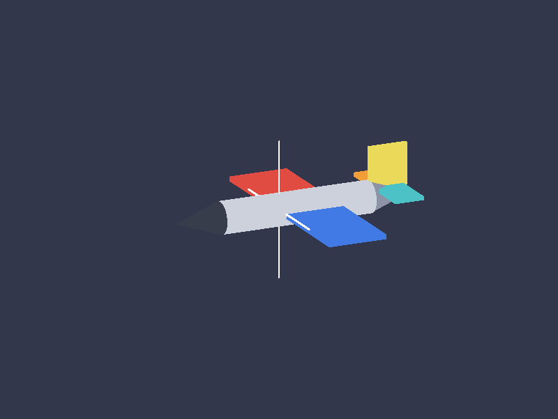
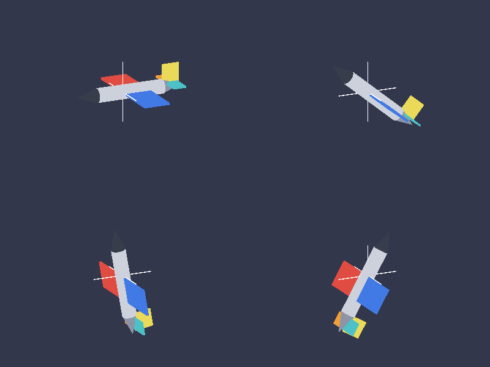
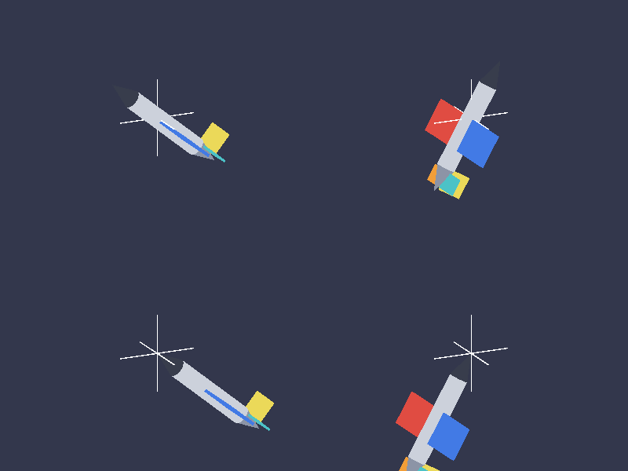
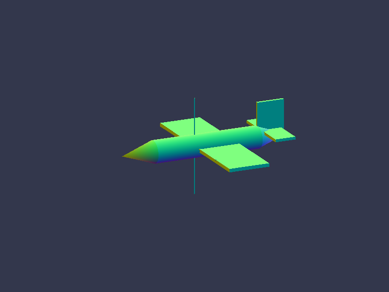

# Práctico 04 — Armado de la aeronave

Aeronave de referencia: **SIAI Marchetti / Aermacchi S-211**, las tres vistas de
la guía (p. 1). Todas las medidas son relativas al largo del fuselaje, con
`L_f = 1`.

## Cómo ejecutarlo

Desde **Git Bash** (el `Makefile.master` usa `mkdir -p`, así que PowerShell no
sirve):

```bash
export PATH="/c/msys64/mingw64/bin:$PATH"
cd practico04-aeronave
mingw32-make
./bin/ogl-app
```

| argumento | qué hace |
|---|---|
| `[número]` | cantidad de gajos de las primitivas de revolución (por defecto 24) |
| `normales` | usa el fragment shader de depuración de normales |
| `quieto` | arranca en pausa, para mirar el despiece sin que se mueva |
| `captura` | dibuja cuatro cuadros a ángulos de cabeceo conocidos, vuelca cada uno a `captura-N.ppm` y termina |
| `sinref` | con `captura`, hace lo mismo pero con el punto de referencia en la nariz |

| tecla | qué hace |
|---|---|
| `1` / `2` / `3` | cabeceo / guiñada / alabeo (se pueden combinar) |
| `0` | deja de rotar |
| `espacio` | pausa y reanuda |
| `P` | muestra u oculta la marca del punto de referencia |
| `O` | mueve el punto de referencia a la nariz, para ver el error |
| `Esc` | salir |

## El despiece

**Ocho piezas, ocho matrices locales, tres mallas en la GPU.** La asimetría es
lo que se quería mostrar: las dos alas son el *mismo* VBO leído dos veces con
dos matrices distintas.

| # | pieza | primitiva | cómo se dimensiona |
|---|---|---|---|
| 1 | fuselaje central | cilindro | parámetros de la primitiva (sin escala) |
| 2 | nariz | cono | el cono tal cual (escala 1) |
| 3 | cola | cono | el **mismo** cono, escala **uniforme** |
| 4 | ala derecha | cubo | escala no uniforme → placa |
| 5 | ala izquierda | cubo | ídem, espejada por **traslación** |
| 6 | estab. horizontal derecho | cubo | ídem, más chico |
| 7 | estab. horizontal izquierdo | cubo | ídem |
| 8 | deriva | cubo | ídem, parada sobre el eje Y |

Sistema de referencia del modelo: origen en la **nariz**, `+Z` de la nariz a la
cola, `+Y` arriba, `+X` a estribor. Es el ejemplo que da la filmina.

Punto de referencia: `(0, 0, 0.438)`, o sea **0.438 · L_f desde la nariz**,
sobre el eje del fuselaje, tal como lo ubica la figura de la guía (p. 3).

Los dos lados llevan colores distintos a propósito: es la única forma de ver a
simple vista, mientras rota, cuál ala sube.



## Lo que se verificó

### 1. Las mallas salen bien y ningún triángulo queda invertido

Verificación sin dibujar del Práctico 03 (producto vectorial contra la normal
de los vértices), corrida sobre las tres mallas al arrancar:

```
Mallas de la aeronave (gajos = 24):
  cilindro  vertices: 100   indices: 288   triangulos: 96   winding invertidos: 0
  cono      vertices: 74    indices: 144   triangulos: 48   winding invertidos: 0
  cubo      vertices: 24    indices: 36    triangulos: 12   winding invertidos: 0
Despiece: 8 piezas sobre 3 mallas
Punto de referencia: (0, 0, 0.438)  = 0.438 * L_f desde la nariz
```

### 2. Ninguna pieza simétrica usa escalado negativo

El ala izquierda se obtiene con una **traslación** a `x` negativo, no con
`scale(-1, 1, 1)`. Una escala negativa tiene determinante negativo: invertiría
el winding, y esa ala desaparecería con el descarte de caras traseras
habilitado. Se puede espejar por traslación porque el ala es simétrica respecto
de su propio plano.

### 3. Al aplicar la pose, las ocho piezas giran juntas

Cuatro cuadros a cabeceo 0°, 40°, 80° y 120°, volcados desde el framebuffer con
`glReadPixels` (no son capturas de pantalla: no dependen de qué ventana tenga el
foco). La cruz blanca marca el punto de referencia y **no se mueve**.



Ninguna pieza se despega, ninguna se atrasa y el conjunto no se corre de lugar:
la misma `M_pose` multiplica a las ocho matrices locales.

### 4. El giro es alrededor del punto de referencia y no de un punto arbitrario

Arriba, con el punto de referencia en `0.438·L_f`; abajo, el **mismo código**
con el punto de referencia movido a la nariz. Mismos ángulos (40° y 120°).



Abajo la nariz se queda clavada en la cruz y la cola sale despedida fuera del
cuadro. Es exactamente el error que evita el `T(-ref)` de la derecha de la
composición.

### 5. Modo de depuración de normales



Degradé suave alrededor del eje en el lateral del cilindro y del cono, color
plano en cada cara de las placas: las normales de las primitivas del Práctico 03
siguen siendo correctas después de componer el modelo.

### 6. El `main.cpp` no tiene ninguna llamada `glDelete*`

```
$ mingw32-make check-main
OK: no hay ninguna llamada glDelete* en main.cpp
```

### 7. Compila sin una sola advertencia

Con `-O2 -Wall -Wextra`, incluidos los módulos heredados de los prácticos 01 a
03.

## Dónde están las respuestas a las "cuestiones a pensar"

Todas están escritas en el código, junto a la decisión que justifican:

| cuestión | dónde |
|---|---|
| Qué guarda un `RenderItem` y por qué un puntero y no una malla | `src/aircraft/RenderItem.h` |
| `collect()` antes de `update()`, y antes de `init()` | `src/aircraft/Aircraft.h`, "cuestiones de la Parte 1" |
| Por qué separar `init()` de `update()`, y qué costo tendría no hacerlo | ídem |
| Qué cambia el día que las piezas vengan de un `.obj` | ídem |
| Escalado negativo para las piezas simétricas | `src/aircraft/Aircraft.h`, "cuestiones de la Parte 2" |
| Normales bajo escalado no uniforme, y para qué piezas no importa | ídem |
| Cuántas mallas distintas y cuántas matrices locales | ídem |
| De qué lado va el `T(-ref)` y qué pasa si se lo pone del otro | `src/aircraft/Aircraft.h`, "cuestiones de la Parte 3" |
| Un alerón que se deflecta: ¿alcanza la matriz local fija? | ídem |
| ¿Hace falta un árbol de transformaciones? ¿Cuándo dejaría de alcanzar? | ídem |
| En qué se aparta esta clase del esqueleto de la guía | `src/aircraft/Aircraft.h`, sección propia |

## Lo que todavía es caja negra

`uAjuste` sigue siendo la caja negra del Práctico 03, y ahora carga tres cosas:
la corrección de relación de aspecto, la negación del eje Z y —nuevo— una
**rotación de vista fija** (115° de guiñada, 18° de cabeceo) más un acercamiento
de 1,25.

La rotación hace falta porque sin ella el eje del fuselaje apunta al observador
y la aeronave se ve de punta. Elegir desde dónde se mira es trabajo de la matriz
de vista, y el acercamiento es trabajo del campo visual de la proyección: las
dos cosas llegan en el **Práctico 05**, y por eso hoy están acá.

El 1,25 no se eligió a ojo: el punto del modelo más lejano al de referencia está
a 0,756, y 0,756 × 1,25 = 0,945 < 1, así que el conjunto entra en el volumen de
recorte para cualquier rotación.
